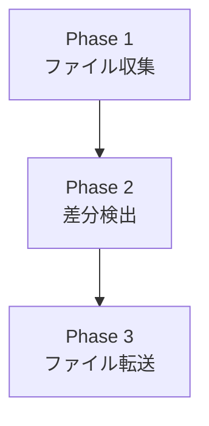

# 仕様書・設計ドキュメント作成

本リポジトリのドキュメント規約をまとめる。

## 仕様書の構成パターン

広義の内容から詳細へ掘り下げる構成にする。

## 書式ルール

基本規約は `markdown.instructions.md` に従う。

### mermaid 図

- ブロック内の改行は `\n` ではなく `<br>` を使用する



### テーブル

```markdown
| フィールド | 型     | 説明               |
| ---------- | ------ | ------------------ |
| path       | string | 検索対象フォルダ   |
| file_type  | string | CSV / JSON / JSONL |
```

## ドキュメント品質基準

- 古い記述が残っていないか確認する
- 重複した説明を排除する
- より理解しやすい表現に改善する
- 広義の内容から詳細へ掘り下げる構成にする

## 日本語テクニカルライティング指針

- 主語と述語を近づける
- 一文を短く保つ
- 箇条書きを積極的に使う
- 技術用語は初出時に説明を添える
- コード例を豊富に含める
