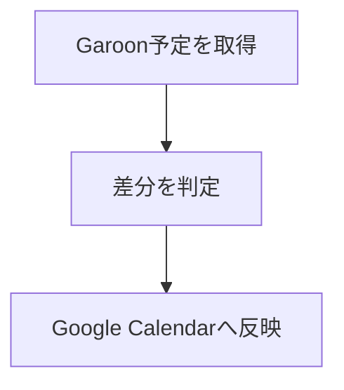

# 仕様書, 設計ドキュメント作成

本リポジトリのドキュメント規約をまとめる。現行 repo の文書は Garoon, Google Calendar, Google Apps Script の運用と同期仕様を中心に扱う。

## 前提コンテキスト

- 書式ルール: [markdown.instructions.md](../../instructions/markdown.instructions.md)
- 実装と仕様の突合: [sync-garoon-to-google-development](../sync-garoon-to-google-development/SKILL.md)
- ドメイン参照用の既存文書: [docs/Garoon_GCal\_項目マッピング.md](../../../docs/Garoon_GCal_項目マッピング.md), [docs/Garoon\_在席情報リセット機能.md](../../../docs/Garoon_在席情報リセット機能.md), [docs/Garoon_API\_リファレンス.md](../../../docs/Garoon_API_リファレンス.md)

- 書式の正本は [markdown.instructions.md](../../instructions/markdown.instructions.md) とし、既存 docs は用語と仕様範囲の確認に使う

## 書式ルール

基本規約は [markdown.instructions.md](../../instructions/markdown.instructions.md) に従う。

### 関連文書への参照

[markdown.instructions.md](../../instructions/markdown.instructions.md) の「参照リンク」に従う。

```markdown
項目変換の詳細は [docs/Garoon_GCal\_項目マッピング.md](../../../docs/Garoon_GCal_項目マッピング.md) を参照する。品質観点は [ドキュメント品質基準](#ドキュメント品質基準) を参照する。
```

### 仕様書の命名規則

本リポジトリでは以下の命名規則を採用する。

- ファイル名だけで対象とテーマが分かる名前にする
- 既存文書に合わせて `Garoon_機能名.md`, `Garoon_GCal_テーマ.md` のように対象ドメインを先頭に置く
- `仕様.md` のような汎用名だけで終わらせず、対象機能や運用テーマを含める

### mermaid 図

- 書式, 使用場面の選択: [markdown.instructions.md](../../instructions/markdown.instructions.md)
- 図の内容, ノード構成: 本スキルの規約に従う



### テーブル

```markdown
| フィールド | 型     | 説明               |
| ---------- | ------ | ------------------ |
| path       | string | 検索対象フォルダ   |
| file_type  | string | CSV / JSON / JSONL |
```

## 更新時の連動

- 振る舞い変更を記述する場合は、実装と文書のどちらが正本かを先に明確にする
- `sync()`, `resetPresence()`, ScriptProperties に影響する変更では README か docs の更新要否を確認する
- 既存の用語 (`Garoon`, `GCal`, `ScriptProperties`, `nosync`) を不用意に言い換えない

## ドキュメント品質基準

### 正確性

- 古い記述や廃止された仕様が残っていないか
- コード例が現在の実装と一致しているか
- パス, ファイル名, クラス名が実態と合っているか

### 構成

- 広義の内容から詳細へ掘り下げる順序になっているか
- 見出し階層が論理的に整理されているか

### 可読性

- 一文が長すぎないか (目安: 60 文字以内)
- 箇条書き, テーブル, コード例を適切に使い分けているか
- 技術用語の初出に説明があるか
- 関連文書や関連セクションの参照が、追跡しやすいリンクになっているか

## 日本語テクニカルライティング指針

- 主語と述語を近づける
- 一文を短く保つ
- 箇条書きを積極的に使う
- 技術用語は初出時に説明を添える
- コード例を豊富に含める
