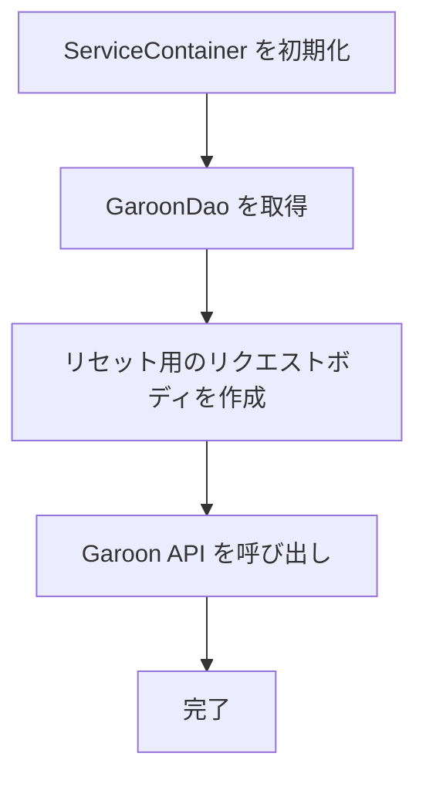

# Garoon 在席情報リセット機能

## 概要

Garoonに登録されている自分の在席情報（プレゼンス情報）を初期状態にリセットする機能です。Google Apps Scriptから簡単に実行でき、ステータスとメモの両方を空の状態に戻すことができます。

## 機能説明

### 目的

Garoonの在席情報には以下のような情報が含まれます:

- **ステータスコード**: 「在席」「外出」「離席」「会議中」などの状態
- **メモ**: 在席情報に関する補足説明（「15:00まで会議中」など）

この機能を使用することで、これらの情報を一括でクリアし、初期状態（未設定状態）に戻すことができます。

### 使用場面

1. **退勤時の情報クリア**
    - 1日の業務終了時に在席情報をリセット
    - 翌日の出勤時に前日の情報が残らないようにする

2. **外出・離席状態の解除**
    - 外出から戻った際に状態を解除
    - 離席状態を自動的にクリア

3. **誤設定の修正**
    - 誤って設定した在席情報を素早く削除
    - 不要な情報のクリーンアップ

## 実行方法

1. Google Apps Script エディタを開く
2. 関数選択ドロップダウンから `resetPresence` を選択
3. 実行ボタン（▶）をクリック

## 内部実装

### 処理フロー



リセット用のリクエストボディ:

```json
{
    "status": {
        "code": ""
    },
    "notes": ""
}
```

### 使用するAPI

**エンドポイント:**

```text
PATCH /g/api/v1/presence/users/code/{userCode}
```

**リクエストボディ:**

```json
{
    "status": {
        "code": ""
    },
    "notes": ""
}
```

- `status.code`: 空文字列を指定することでステータスをリセット
- `notes`: 空文字列を指定することでメモをリセット

**詳細:** [Garoon REST API - プレゼンス更新](https://cybozu.dev/ja/garoon/docs/rest-api/presence/users/update-user-presence/)

## 設定要件

### 必須設定

この機能を使用するには、以下の設定が `ScriptProperties` に登録されている必要があります:

1. **Garoon ドメイン**

    ```javascript
    PropertiesService.getScriptProperties().setProperty(
        "GAROON_DOMAIN",
        "your-subdomain.cybozu.com",
    );
    ```

2. **Garoon ユーザー名**

    ```javascript
    PropertiesService.getScriptProperties().setProperty(
        "GAROON_USER_NAME",
        "your-username",
    );
    ```

3. **Garoon パスワード**

    ```javascript
    PropertiesService.getScriptProperties().setProperty(
        "GAROON_USER_PASSWORD",
        "your-password",
    );
    ```

### 権限

- Garoon APIへのアクセス権限
- プレゼンス情報の更新権限（自分自身の情報のみ）

## 制限事項

1. **他のユーザーの情報は変更不可**
    - 自分のアカウントで認証しているため、自分の情報のみが対象

2. **ステータスの個別設定は不可**
    - この関数はリセット専用
    - 特定のステータスに設定する場合は、`GaroonDao.updatePreference()` を直接使用

3. **一括処理は非対応**
    - 1回の実行で1ユーザーのみ
    - 複数ユーザーの場合は、それぞれの認証情報で個別実行が必要

## 参考資料

- [Garoon REST API - プレゼンス情報の更新](https://cybozu.dev/ja/garoon/docs/rest-api/presence/users/update-user-presence/)
- [Garoon REST API - 認証方法](https://cybozu.dev/ja/garoon/docs/rest-api/authentication/)
- [Google Apps Script - Time-driven triggers](https://developers.google.com/apps-script/guides/triggers/installable#time-driven_triggers)
- [sync-garoon-to-google/src/main/script.js](../sync-garoon-to-google/src/main/script.js) - `resetPresence()` 関数
- [sync-garoon-to-google/src/dao/GaroonDao.js](../sync-garoon-to-google/src/dao/GaroonDao.js) - `updatePreference()` メソッド
